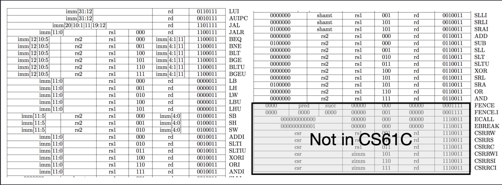

# CS61CPU

Look ma, I made a CPU! Here's what I did:
- [x] ALU
- [x] RegFile
- [x] ImmGen
    - [x] I-type format
    - [x] S-type format
    - [x] B-type format
    - [x] U-type format
    - [x] J-type format
- [x] Branch Comparator
- [x] Instruction Supported:
    - [x] R-type Instructions
    - [x] I-type Instructions
        - [x] algorithm
        - [x] load
        - [x] jalr
    - [x] S-type Instructions
    - [x] B-type Instructions
    - [x] U-type Instructions
    - [x] J-type Instructions
    - [x] CSR Instructions (not write to registers)
- [x] 2-steps pipelined CPU (IF, EX)
Finished all the riscv-i instructions! (except for the fence, the environment call and the csr instructions)

