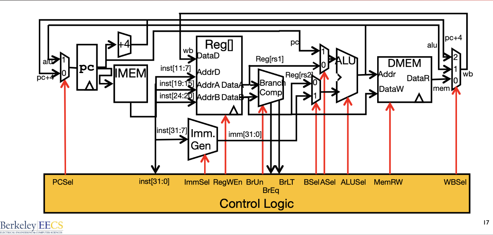
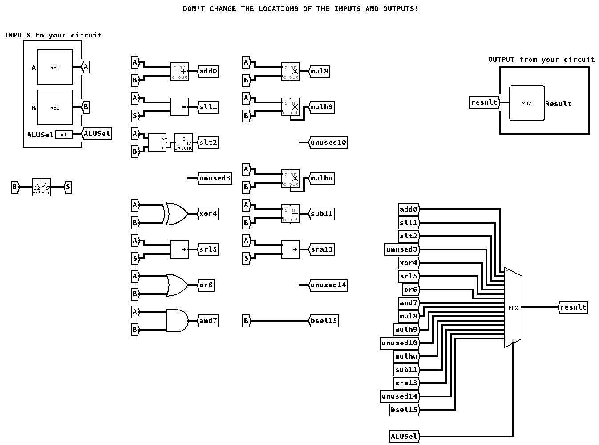
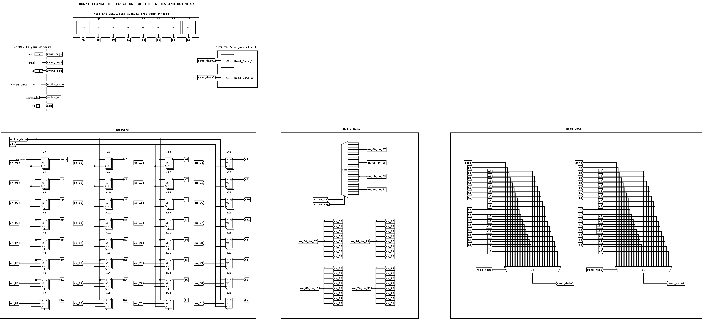
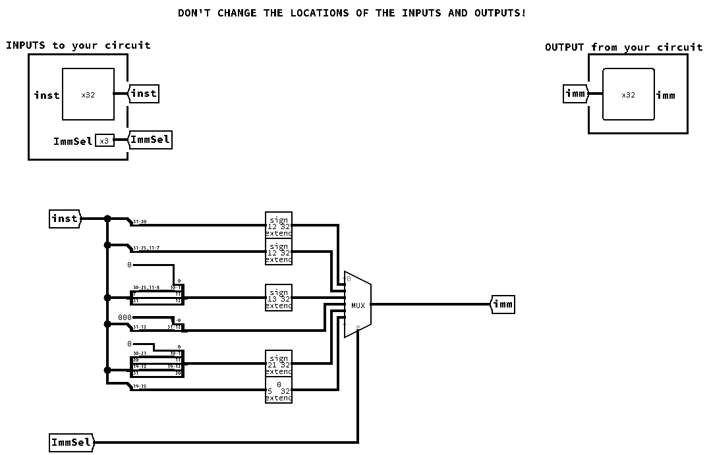
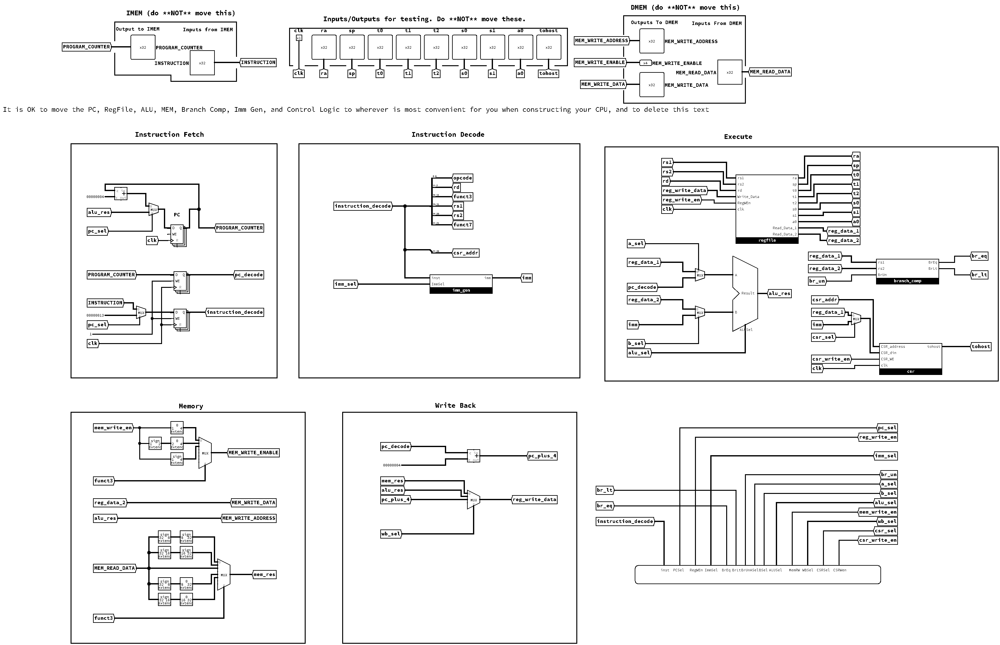

# CS61CPU

Look ma, I made a CPU! Here's what I did:
- [x] ALU
- [x] RegFile
- [x] ImmGen
    - [x] I-type format
    - [x] S-type format
    - [x] B-type format
    - [x] U-type format
    - [x] J-type format
- [x] Branch Comparator
- [x] Instruction Supported:
    - [x] R-type Instructions
    - [x] I-type Instructions
        - [x] algorithm
        - [x] load
        - [x] jalr
    - [x] S-type Instructions
    - [x] B-type Instructions
    - [x] U-type Instructions
    - [x] J-type Instructions
    - [x] CSR Instructions (not write to registers)
- [x] 2-steps pipelined CPU (IF, EX)  

Finished all the riscv-i instructions! (except for the fence, the environment call and the csr instructions)

## Micro Architecture

### ALU

| ALUSel Value | Instruction                              |
| ------------ | :--------------------------------------- |
| 0            | add: `Result = A + B`                    |
| 1            | sll: `Result = A << B`                   |
| 2            | slt: `Result = (A < B (signed)) ? 1 : 0` |
| 3            | Unused                                   |
| 4            | xor: `Result = A ^ B`                    |
| 5            | srl: `Result = (unsigned) A >> B`        |
| 6            | or: `Result = A \| B`                    |
| 7            | and: `Result = A & B`                    |
| 8            | mul: `Result = (signed) (A * B)[31:0]`   |
| 9            | mulh: `Result = (signed) (A * B)[63:32]` |
| 10           | Unused                                   |
| 11           | mulhu: `Result = (A * B)[63:32]`         |
| 12           | sub: `Result = A - B`                    |
| 13           | sra: `Result = (signed) A >> B`          |
| 14           | Unused                                   |
| 15           | bsel: `Result = B`                       |

### RegFile

### Immediate Generator

| ImmSel Value | Description      |
| ------------ | :--------------- |
| 001          | I-type format    |
| 010          | S-type format    |
| 011          | B-type format    |
| 100          | U-type format    |
| 101          | J-type format    |
| 110          | CSR instructions |

### Data Path

### Control Logic

### 

### Data Path 2-steps pipeline

